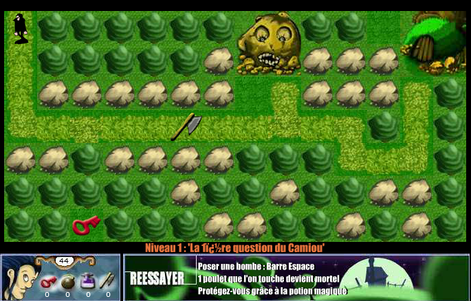
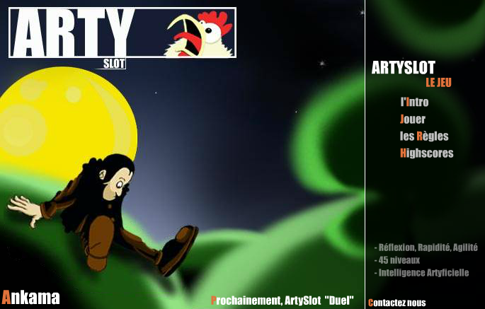

# **Arty Slot et d'autres jeux flash pré Dofus**

## **Les jeux Arty Slot**
### **1. Historique**

Vers fin 2002 ou début 2003, ankama qui créais du contenu flash pour les sites internet, avais crée un jeu de plateforme appelé FOO, ensuite ils ont sorti une Trilogie de jeux nommé Arty. Arty semble être le nom du personnage.  D'après [wikipedia](https://fr.wikipedia.org/wiki/Ankama_Games) et [dofuswiki fandom](https://dofuswiki.fandom.com/wiki/Ankama_Games), il a existé un jeu Arty slot: block battle, un style de tétris, mais il y a 2 autres jeux arty qui sont sorti et dont on peux encore trouvé quelques traces. A la suite de cette trilogie est sorti arty slot: duel, qui a été renommé en dofus.

### **2. Arty Slot Chicken Quest**
Il semble s'agir d'un jeu shoot'em up, [il y a des traces ici](https://web.archive.org/web/*/http://chickenquest.ankama.com/*), malheureusement, les fichiers swf ne sont pas récupérable donc impossible de rejouer au jeu.

### **3. Arty Slot**

#### **1. Le jeu**

Un swf du jeu peux etre trouvé sur archive.org via ce [lien](https://web.archive.org/web/*/http://www.artyslot.com/*) on peux y récuperer le jeu ainsi qu'un fichier de niveau.  
Le jeu semble être un enchainement de niveau ou il faut résoudre des enigmes et arriver au niveau maximum (45 dans la version disponible), un laderboard était disponible avec la possibilité d'envoyer les résultats en ligne, il s'agit d'un jeu flash tout simple que l'on trouvais sur certains site.

Voici le niveau 3 du jeu:

Coté développement, il s'agit d'un jeu très simple, il y a 1 élément/case, on peux récupérer des items qui sont sur le sol et les utiliser pour résoudre des énigmes.
Il s'agit, à mon avis, d'une des toutes premières bases de dofus avec le déplacement case par case et l'intéraction avec le décor.

#### **2. Le personnage**
Un point qui m'a interpelé içi, on remarque que arty est habillé en noir, il a un coté roublard de dofus, or par la suite, il s'agit plutot d'un féca.

L'écran d'accueil du jeu, ou l'on y vois le personnage, le nom d'ankama ainsi que l'information de la sortie prochaine du jeu arty slot: duel.

### **Arty slot Duel / Arty's World**

Bien que Duel ne semble pas avoir été prévu en premier pour être multijoueur, on peux trouver [ici](https://web.archive.org/web/20011117200253/http://www.ankama.com:80/duel_demo.asp) les traces d'une démo de 2001 qui a été crée pour un concours du magazine joystick, d'après le texte, il s'agit des tous premiers éléments du jeu. Le jeu s'appel duel demo et est dans l'univers arty's world: les premières bases de dofus semblent être nées en 2001.

### **Tankrace**

En cherchant un peux, on trouve également la trace d'un autre jeu, plus mauvais que les autres: tankrace, on peux trouver le jeux ainsi que des informations [ici](https://web.archive.org/web/*/http://tankrace.ankama.com/*). Il s'agit d'un jeu de course de tank, il semble qu'il était jouable en multijoueur, il a du être crée par ankama et pas simplement héberger car l'interface est globalement la même que celle d'arty slot.