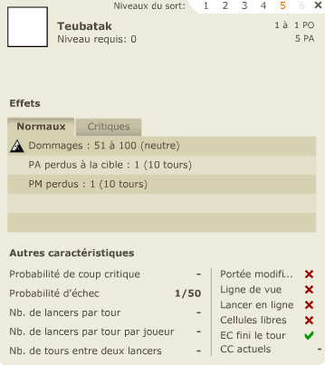
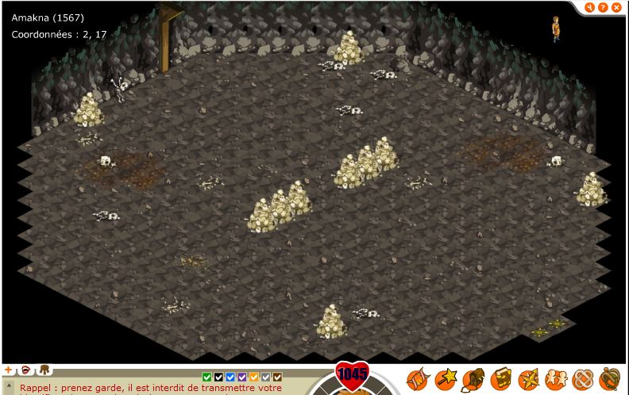
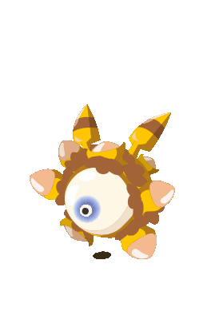
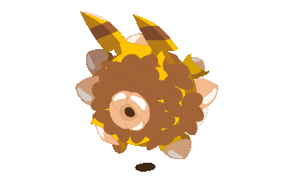
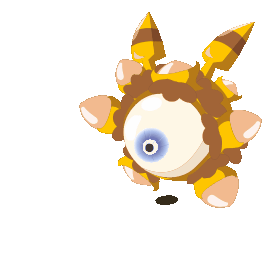
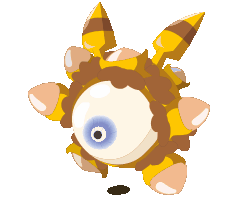

# Le bitolder
-----

## 1. Ses fichiers dans le jeu:
Le bitolder est présent dans les sprites du jeu, à ma connaissance, le fichier est seulement présent dans la 1.9.1.  
Le fichier se nomme: 1094.swf et est dans le dossier /clips/sprites/ du jeu, le fichier semble avoir été crée avec flash 6. 
La version 1.0 ayant un sprite n°1095, il est possible qu'il est été implanté avant cette version.  
D'autres références à ce monstre sont égalements présentes dans d'autres endroits:
    - dans les "langs", dans la version française il est nommé bitolder.
    - dans le fichier sprite.xml (présent à partie de la 1.16), il est appelé BITEHOLDER. Il est supprimer de ce fichier dans les dernières version de la version 1 du jeu (dans les 1.20).  

Note: On peux s'incarner en "bitolder" mais il n'a pas d'apparence, le fichier est probablement trop vieux, je suppose qu'il faudrais utiliser une version du jeu basée sur flash 7 ou flash 6 (avant dofus 1.10 pour flash 7, version 1.0 ou beta pour flash 6), avec le temps le fonctionnement des sprites ayant changé, utilisé le fichier de la 1.9 avec cette même version semble la seule chance de voir le bitolder en jeu.

## 2. Ses infos:
Ses caractéristiques sont disponible ici: https://dofuswiki.fandom.com/wiki/Bitolder ( et il me semble sur un autre site avec son image mais je n'ai plus le lien).
Infos extrait des fichiers:
- id: 151 (comme le premier pokemon) ( l'id 150 est le Noeul, monstre qui lui ressemble un peu)
- gfxid (sprite): 1094
- le monstre a 6 "niveaux", à chaque fois il est lvl 100
- les resistances du wiki fandom semblent correctes:  
  - 25% neutre, 10% terre, 40% feu, 30% air et eau
  - les résistances feu font: 40%,400%,760%,1120%,1480%
- Le nom anglais du monstre semble également le bitolder.

Le monstre n'a pas de petite image qui s'affiche lorsque c'est a son tour de jouer.
Il n'a également aucune ressource associée.
Il est dans la catégorie monstres divers / Boss. (cf: solomonk.fr le bestiaire)

## 3. Son sort:
A ma connaissance, c'est son seul sort.

- nom: Teubatak
- Spell id: 237 (dans clips/spells)
- Aucun élément d'attaque

Le nom anglais est également Teubatak.

Le sort ne semble pas avoir d'animation.

Voici son sort:

Le sort ne semble pas équilibré. Probablement un placeholder.

## 4. Sa map: La grotte de loopine

/!\ La version 1.17 ayant apporté une mise à jour graphique d'amakna (je ne suis pas sur que ca soit cette version précise mais elle a eu lieu), il est possible que la map est subit une modification.  
Infos de la map:
- mapid: 1567
- coordonnées: 2,17
- capabilities: 15 (en français, la capacité de la map? à noter que la map de la piscine à pichon de sufokia est la seule autre map à avoir cette valeur)
- La map semble exister depuis avant la 1.0, je n'ai pas les map de dofus 1.0, cependant sur la map de dofus 1.0 on vois sur qu'il y a une maison sur la mapmonde (comme sur dofus retro).

Voici la map sur laquelle devait être le bitolder: (il s'agit d'une version de mai 2005)

La map est une grotte, les "murs" sont bien fonctionnels mais il y a une possibilité de se déplacer sur les cases noires derrière les murs de la map.

Elements "interessants" de la map:
- Ressemble à la map dragon cochon.
- Beaucoups de squelettes.
- Aucune mention nommée Grotte de Loopine.

La map n'existe plus dans les versions 1.20, elle semble avoir été retirée, tout comme le bitolder.

La première version de cette map que je possède date de mai 2005 (version 1.7), elle a peux être des version encore plus anciennes.

## 5. La map de l'entrée de la grotte

J'écris cette partie à la suite d'autres recherche.
En regardant la mapmonde de dofus retro, on vois sur la map 2,17 qu'il y a une maison, au départ je pensais que c'était pour signaler la présence de la grotte, cependant, il y a une chose intéressante à connaitre.
A partir de la 1.0, la carte semble être la version "finale", celle qui est dans dofus rétro actuellement. En revanche, si on regarde [ici](https://web.archive.org/web/20040808030022/http://ophmialeen.free.fr:80/map.htm) et [ici](https://web.archive.org/web/20161017180243im_/http://ophmialeen.free.fr/MapDofusQM/1024.jpg) (une map "interactive des premières versions du jeu), on remarque que sur la carte de la version beta 16b, il y a une maison appelée "La maison Arbre", si on prend une carte de la version site web au lieu de la version png, la sauvegarde du site du 5 et 8 aout 2004 (dates de la beta 17, la version 1.0 étant sortie fin aout) indiquent que la maison est désormais à la place de l'atelier alchimiste en 1,16 et qu'il y a désormais une grotte avec un pnj (Loopine) devant.
J'en déduis que la beta 17 à été la version du changement et de l'arrivée de la grotte et de Loopine.

Pour finir, sur la carte du monde de la version 1.0 à dofus retro, on remarque qu'il y a une maison en 2,17 , cette maison serait en réalité la maison arbre, la carte du monde d'amakna n'a donc jamais été mise à jour.

## 6. Ses animations:  
Le logiciel que j'ai utilisé ne m'a pas permis de récuperer des sprites correct.

Il est possible que les animations de sort du monstre soient présentes ici et intégrées à sont sprite.
Il semble y avoir 2 "versions": 
- Une sans oreilles
- Une avec des oreilles à la manière de pikachu

  
  
  
  
  
  
  
  
 

Enfin, peux être son sort:  
 

## 7. Théories / Suppositions:

Il y a beaucoup à supposer sur ce monstre.
La map semble être "vieille", mon plus vieux fichier semble être de 2005,  elle semble avoir été crée pour la beta 17, peu de temps avant la 1.0. Comme le dit kam dans son interview, quelques mois avant la fin de la beta (début 2004, vers les dernières versions beta, 16 et 17 probablement), ils ont ajoutés une grosse quantité de monstres. Les premères beta (5 et 7) que je possède ont vraiment peu de monstres, moins de 50, en revanche à partir de la 1.0 on remarque que le sprite 1093 et le sprite 1095 existent. C'est comme si le bitolder avait déja été supprimé avant d'être mis en jeu. 

Une question assez étrange, pourquoi le monstre apparait d'un coup dans la 1.9.1?
Comme le monstre à été crée pour la version beta 17, je pense que quelque chose en lien avec le monstre était prévus, une tentative d'ajouter ce monstre aurais pu être tenté avec la version 1.9, ce qui correpond également à la date de la version de la map de 2005 (la map semble être "pensée" depuis la beta 17 également, elle a pu subir une mise à jour pour la version 1.9). Ne possédant ni la version 1.8 ni les versions 1.10,1.11,1.12, je ne pas confirmer qu'il était présent dans ces versions. A partir 1.13 il a été retiré et "oublié".  
De plus, le changelog de la 1.8 fait mention d'un boss de niveau moyen à combattre. [Lien vers le changelog de la 1.8](https://www.dofus.com/fr/forum/1750-dofus/17140-modifications-version-1-8).
Il est fort possible que le monstre devait être un peu comme le dragon cochon: trouvable dans une grotte, sous la forme de boss. Les changelogs 1.7, 1.8, 1.9 font également mention de nouveaux items, nouvelles ressoures implantées en masse, le bitolder devait peux être servir à obtenir ces ressources.  

L'apparition soudaine en version 1.9.1 pourrait être dû à une fuite du fichier dans la version "release" du jeu. Le sprite du monstre étant crée avec flash 6, ce qui correspond à des versions très anciennes ( versions beta / version 1.0 et peux être quelques versions suivants celle ci). Comme dit juste avant, le fait que la carte ayant été mise à jour pour la version 1.9, il est possible que la map et le bitolder ai été testé en interne mais que finalement ce contenu soit supprimé partiellement au moment du passage en version officielle mais que le sprite soit resté dans les fichiers du client (je rappel qu'à l'époque on ne faisait pas attention au data mining, peu de monde s'y interessais).

Le retrait pourrais être lié au passage à flash 8 à partir de la 1.10, ceci expliquerai le changement d'id de certains sprite et que le bitolder soit retiré. De plus, l'organisation interne des sprite semble différent, dans les version 1.10+ le monstre est affichable mais invisible, il s'agirait d'un simple changement d'organisation dans les sprites (test avec le boufton noir: lorsqu'il est immobile, il s'agit de l'animation du boufton qui se déplace). Le sprite ayant été crée sous flash 6, il est possible que le bitolder soit donc un monstre "bug", de plus [ici](https://www.dofus.com/fr/forum/1750-dofus/2237-maj-15-nov-2004-aurez-soir) Tot évoque un problème de compatibilité entre flash 6 et 7, il est donc possible que le problème du bitolder vienne de la et qu'il n'est jamais été corrigé. De plus, d'après une vidéo de Liche sur le bitolder, un joueur reporte qu'a un moment les joueurs se faisait aggressé par le bitolder et qu'il était invisible, cela correspond potentiellement à un bug de version de flash player, comme il y avais beaucoup de différence entre les versions flash 6, flash 7 et flash 8, On peux imaginer un problème de compatibilité de lecture des sprite.

Enfin, les références au monstre. La encore, cela montre le problème des développeurs qui ne supprime pas le code inutile (en avril 2021, sur la version 2.58 de dofus, on a toujours les informations de temporis 4 dans le client, 1 an après). Pour le bitolder, les fichiers sont restés plusieurs années, en 1.20, il n'y a plus aucune trace de ce monstre et de sa map, il semble y avoir eu un nettoyage dans les débuts des versions 1.20, le changement d'architecture du fichier Sprites.xml explique cette suppression.

Pour le fichier Sprites.xml, le nom BITEHOLDER du monstre serait l'explication du jeu de mot (valable pour beaucoup d'autres jeux de mots de monstre dans le jeu).
BITE HOLDER, en traduisant holder de l'anglais cela donnerait le possesseur de bite? ca me semble cohérent avec l'image du monstre. 

Pour l'id du monstre (151), il semble être un clin d'oeil potentiel a pokémon, 151 étant le nombre de pokémon en génération 1, il faudrais faire quelque chose de très compliqué pour l'avoir, tricher ou bien pour beaucoup de monde "normal" il existera mais sera impossible à voir ou à récuperer.

Pour la map: elle ne semble pas avoir été finalisée, on peux se déplacer derrière les murs. La map extérieur semble être comme ceci depuis avant la 1.0, ce qui montre bien que le monstre et sa grotte ont pu être planifié depuis avant la 1.0 mais que comme d'autres choses, ils ont été retiré par manque de temps pour implanter de manière correcte ce contenu ou car ce contenu était bug.

Pour Loopine, il se pourrais que Loopine soit le pseudo d'un ancien dev et que la grotte ne pouvant sortir en l'état ai été "censurée" en placant un pnj Loopine devant la grotte pour montrer que la grotte est inaccessible.

Concernant la carte de l'entrée de la grotte, je pense qu'au départ la maison arbre devais servir, cependant elle a du rester "inutile" jusqu'en version 1.4 (15 décembre 2004), moment de la création du métier d'alchimiste.  
Pour la grotte, elle semble avoir été placée la dans un but précis, probablement pour ajouter un boss dans cette grotte, à la manière du dragon cochon, et Loopine a pu être placé la "en attendant".  
De plus, on sais que dans les dernières versions de la beta, il a été ajouté énormement de monstres pour rendre le pvm intéressant et peupler le monde du jeu, ces ajout ont du se faire en quelques mois, ce qui explique qu'il y a des endroits inutilisés. Pour Loopine, son dialogue n'a peux être jamais changé, on peux supposer plusieurs choses: 
- La grotte était prête pour la beta 17 avec le bitolder dedans, cependant il y aurais pu avoir des bug qui aurait retarder l'implantation en jeu et finalement aucune vraie sortie.
- La grotte aurait pu être préparée, avec le dialogue de Loopine, le lore du bitolder (A ce que j'ai lu, le "lore" du jeu aurait été "forcé" d'être ajouté pour rendre le jeu cohérent et avoir une vraie histoire), cependant le bitolder aurais pu ne jamais être "prêt" à sortir.

Il est possible que la grotte soit un "placeholder" et que le bitolder soit le "placeholder" de la grotte, ce qui expliquerai que tout soit prévu mais jamais sorti officiellement, amakna n'ayant été développé quasiment que pendant la beta puis jamais revu.

Petit ajout:
Le 30 avril 2021, [il est indiqué](https://www.dofus.com/fr/mmorpg/actualites/devblog/billets/1323866-devblog-retro-1-35-approche) qu'il n'était pas rare d'utiliser des monstres "placeholder", en regardant les dernières versions de la version 1, on remarque qu'il y a énormément de "placeholder" et de sprite plus ou moins doublon.
Le bitolder en est donc peux être un.

Pour terminer, si quelqu'un veux terminer ces recherches, je partirais voir du côté de la maison alchimiste en 1,16, il y aurais peux être des éléments de dialogue qui parlerais du bitolder et de l'arrivée de la grotte à la place de la maison.

Je pense avoir tout dit sur le bitolder.

## 8. Les références au bitolder
Merci à Liche qui fait des vidéos sur le sujet et qui en a parler. [Voir sa vidéo](https://www.youtube.com/watch?v=ag4wu9x4Pgs)

- Au timecode 2:48, le pnj Sbab fait référence aux bitolder.
- Au timecode 3:23, le pnj Philémy Barthémon évoque également le bitolder.
- Un bitolder serait présent dans la base des justiciers, emprisonné.

