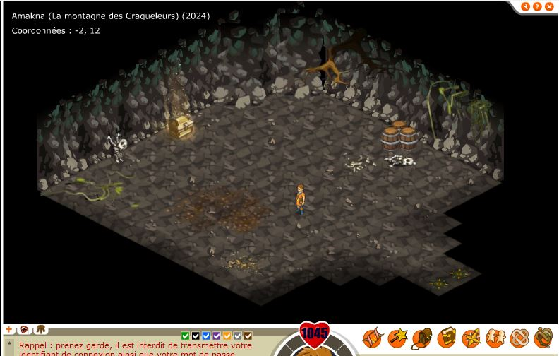

# Le "mystère" des dalles D O F U S (grotte en -2,12)

On sais beaucoup de choses sur cette map et ce coffre. La grotte est encore présente dans dofus retro, sur dofus 2.0 on ne peux plus entrer dans la grotte. 
La grotte étant positionnée juste au dessus du bord de la forêt maléfique et tout en bas de l'endroit ou sera plus tard le village bwork, elle était peux être destinée à être une grotte pour une émote, pour un objet spécifique ou encore pour un boss à affronter (la carte semble dater des premières versions du jeu).

## Infos sur la map:
- mapid 2024
- sur la version de la map d'octobre 2005, le coffre est présent (maj 1.7).
- Le dessin du coffre correspond au style graphique des premières versions du jeu.

## Ce qu'on sais et qui est sur:
- Le coffre, pendant un moment faisais deconnecter le client.
- Concernant les récompenses rien n'a été communiqué officiellement (je n'ai pas exploré tout les changelog).
- Le coffre à été retiré, en revanche depuis une certaine mise à jour, un mulou apparait sur la map.

## Potentiels indices:
- Sur la map cachée sur l'hdv bucheron astrub (dans le trou avec l'échelle, il faut être un sram pour y rentrer), on retrouve le même coffre avec ogivol(vérification possible sur dofus retro). Le coffre à en revanche perdu son aura.
- Un changelog mentionne la correction de coffres  defectueux, il s'agit de la version 1.4.1 (coffre implanté en 1.4?) [changelog 1.4.1](https://web.archive.org/web/20041223155610/http://www.dofus.com/?page=news&rubrique=v1.4.1&contenu=v1.4.1) 
AJOUT ULTERIEUR: le coffre qui fait déconnecter l'est resté jusqu'à sa modification en 2007 donc la 1.4.1 n'a pas corrigé le problème, cependant je laisse cette mention du changelog, cela me semble intéressant.

- Dans un autre changelog, il est indiqué que les émotes et attitudes sont arrivées avec cette version [lien version 1.4.0](https://forums.jeuxonline.info/sujet/422439/news-detail-de-la-mise-a-jour-du-15-et-autres-infos)
    - Emotes ou Attitudes RP
    Pour exprimer ses sentiments, les smileys sont très pratiques, mais il est toujours plus agréable de pouvoir le faire avec son personnage. C'est désormais possible. Par contre, il va falloir gagner ces attitudes dont certaines vous permettront ensuite de résoudre d'autres quêtes.
    - Quêtes  
    Mise en place progressive d'un système de quêtes RP. A vous les chasses aux trésors et autres énigmes rôlistes ! Ce système s'appuie sur les nouveautés présentes et à venir.

- Potentiel première information concernant la grotte, publié le 16 décembre 2004 (la date correspond à la mise à jour 1.4.0), [source de cette information](https://forums.jeuxonline.info/sujet/425906/spoilier-code-de-la-cavene-2-12).
- d'après [ce post](https://forums.jeuxonline.info/sujet/425297-2/listing-des-bugs-de-la-1-4) beaucoup de monde avais des problèmes d'accès aux coffres de maisons lors de la 1.4.0.

## Les changements de la map et du coffre
- La map et le coffre semblent avoir été implantés en 1.4 (ou dans ces environs).
- Dans ses premières versions, la map semble avoir légèrement changée, il est évoqué [ici](https://forums.jeuxonline.info/sujet/426519/spoiler-des-dalles-de-dofus) qu'il y a un coffre, 3 tonneaux mais également un main qui tient 3 bougies, la carte à du subir plusieurs changements (v1 fonctionnelle, v2 coffre bug / retrait de la main, v3 retrait du coffre et ajout du mulou).
- En aout 2007, il est indiqué que le coffre fait deconnecter le client, [source](https://forums.jeuxonline.info/sujet/819764/le-coffre-2-12).
- Fin 2007 le coffre semble avoir disparu et laisser sa place au mulou (maj 1.21), [source](https://forums.jeuxonline.info/sujet/842631/dalles-mysterieuses).

## Image de la map, version d'octobre 2005 avec les graphismes de la version 1.29:

## Théorie:
- Le coffre sur la map cachée de l'hdv bucheron d'astrub serait le coffre qui aurais été volé par ogivol? cela expliquerais sa disparition.
- Le coffre semble avoir été ajouté avec la 1.4.0 ce qui explique le fait que ca soit le même que les maisons et qu'il y est pas mal de joueurs qui en parle. Ces versions de dofus ont ajoutées beaucoup de choses, dans tous les sens, la plupart de ces choses sont aujourd'hui plus ou moins supprimées depuis la 2.0 (ou n'existe plus, ou sont ajoutées par d'autres moyens, par exemple les boss en liberté ou dans des grottes, les émotes ou il faut résoudre des énigmes de dalles, des grottes "secrètes" pour différentes raisons (métier, quetes,...) ).
- Le village bwork ne semblais pas exister à l'époque, il s'agirait de la grotte du boss bwork? ([source](https://web.archive.org/web/20050122194306/http://magoliroub2.online.fr/logitheque/Dofus/carte_dofus.png) ).
- La proximité de la map par rapport au zaap bord forêt maléfique n'aurais aucun rapport, les zaaps étant apparus après la grotte (Avant les zaap, il y avais des runes qui permettait de se tp).

- Comme il à été crée dans des version ou beaucoup de contenu était crée et ajouté à la pelle, il a pu être placé la "pour plus tard" sans jamais être utilisé (et ca ne serais pas la seule chose dans ce cas).

- Il est possible que la grotte et le coffre ai été ajouté pour que les maitres du jeux puissent pendant un évènement utilisé ce coffre, par manque de moyen de distribution de cadeaux aux participants aux évènements autrement, [source](https://forums.jeuxonline.info/sujet/422458/mise-a-jour-du-15-12).

- Il est possible également qu'il ai été prévu pour obtenir une émote.

- Tout comme le bitolder et sa map, il est possible que le coffre ait été retiré car non utilisé et bugué, en revanche, pourquoi avoir garder sa map et mettre un mulou? Une réutilisation de cette map était surement prévue à un moment mais elle ne la jamais été. 

