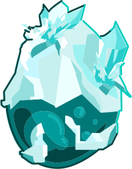
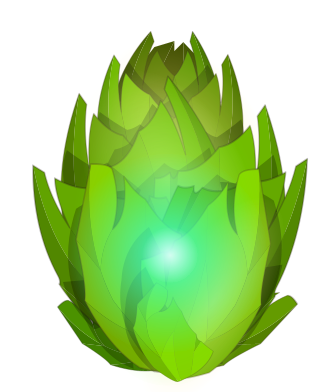
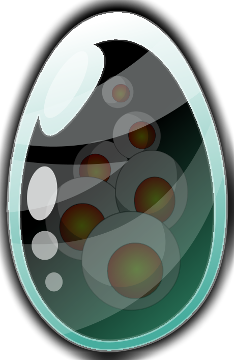
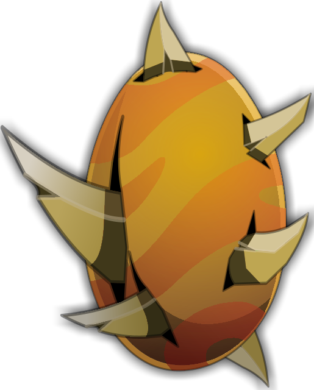
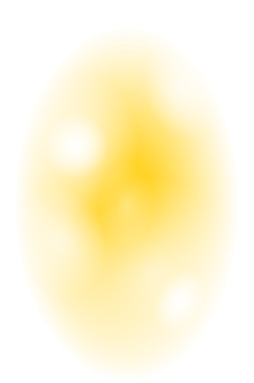
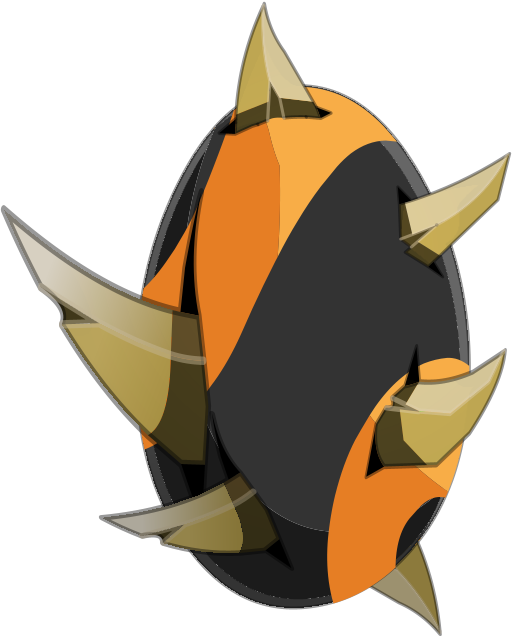

# Les dofus non sorti officiellements
En dehors des dofus ivoire et ébènes implantés dans dofus rétro avec les donjons ilyzaelle et qu'tan, il y a encore d'autres dofus qui ne sont pas utilisés.

# Le dofus cawote 1.0
Avant que le dofus cawotte sorte officiellement avec la version 1.1, il avais une apparence rouge au lieu d'orange:  

## Le dofus des glaces
Un des premiers dofus implanté dans le jeu, il est implanté au moins depuis la version 1.0 du jeu. Il fait partie, avec les dofus emeraude, pourpre, turquoise et cawotte des premiers dofus implantés.  
Le voici dans sa version 1:  

Ses bonus supposés:
- 1 à 10% de résistances terre
- 1 à 10% de résistances feu
- 1 à 10% de résistances eau
- 1 à 10% de résistances air
- 1 à 10% de résistances neutre
- 1 à 10 résistances terre
- 1 à 10 résistances feu
- 1 à 10 résistances eau
- 1 à 10 résistances air
- 1 à 10 résistances neutre

On peux supposer que frigost était prévu depuis la sortie du jeu ou bien qu'il aurait été obtenable via un autre boss, il est étonnant qu'il ne soit pas sorti en version 1.

## Le dofus tâcheté:
Ce dofus peux étrangement être mis en lien avec le dofus ébène et pandala.
Il est présent dans la version 1.13 du jeu mais pas dans la 1.9, il est donc possible qu'il ai été prévu pour pandala, peux être en drop du péki ou ailleurs.  
Voici son image:  

Ses bonus:
- 11 à 20 prospection

On peux imaginer que ce dofus devait être à la place du dofus kaliptus, pourquoi n'est-il pas sortis à sa place? Cet semi implantation prouverai que la version 1 du jeu aurait beaucoup de choses prévues et ajoutées mais jamais totalement ajoutées et je trouve ca vraiment dommage, surtout qu'un dofus sur pandala, pour l'époque, aurait rendu l'ile plus intéressante.  
De même, il semble avoir été implanté dans les mêmes moments que le dofus ébène, la encore, ajouter 2 items intéressants et y ajouter leur background mais ne pas vraiment les rendres disponibles, surtout que les items sont "prêts" et n'aurait besoin que d'un léger équilibrage. 

# Le dofus vinaigrette
Dofus un peu plus mystérieux, je n'ai aucune information sur ce dofus en dehors de sa description et de son jet.

 
Description: Avec ou sans lardons, ce Dofus est toujours aussi bon.

Jet:
- 1 à 3 créatures invocables

Il y a 4 autres dofus mais il n'y a aucune informations sur ceux ci.

## Supplément
Le dofus ivoire a été intégré avec la version 1.16, en même temps que le dofus kaliptus.  
On peux en supposer que 2 dofus par extension était prévu, par exemple, otomai aurait peux être également du avoir 2 dofus obtenable avec un dofus "majeur" et un dofus "mineur" (comme pour le tacheté et l'ébène avec pandala).

