# L'ilot estitch

## Les informations de base sur l'ile

Cette ile est "sortie" dans les fichiers du jeu avec la mise à jour 1.24, les cartes de l'ile sont disponible et sur les versions dofus 1.29 et dofus retro, on peux voir les positions de l'ile sur la map du monde lorsque l'on passe la souris dans la zone entre le nord ouest de bonta et l'ile de nowel. Dans les premières versions de dofus 2, l'ile était disponible, elle  a été développée pour dofus 1 et dofus 2.0, avant d'être introduite réellement en jeu avec la refonte et finalisation des quêtes d'alignements.
La version 1.x et la version des débuts de dofus 2.0 de l'ile sont quasiment identique, la version de l'ile actuelle a juste subit une légère modification pour la moderniser.

Certaines informations que l'on lire sur internet évoque le monstre "Pumbaa" qui serait un monstre de l'ile, cependant ce monstre est listé dans la zone des plaines herbeuses d'otomai, le monstre n'a donc aucun lien avec l'ilot estitch. [Source](https://www.dofus.com/fr/forum/1003-divers/1932436-legendes-mysteres-dofus?sort=rate_D&page=1)(Voir la réponse de Korri en bas de page)

## Les maps
La sous zone ilot estitch existe, les id des maps vont de 12151 à 12159 pour l'extérieur et de 12164 à 12166 pour les cartes intérieures.

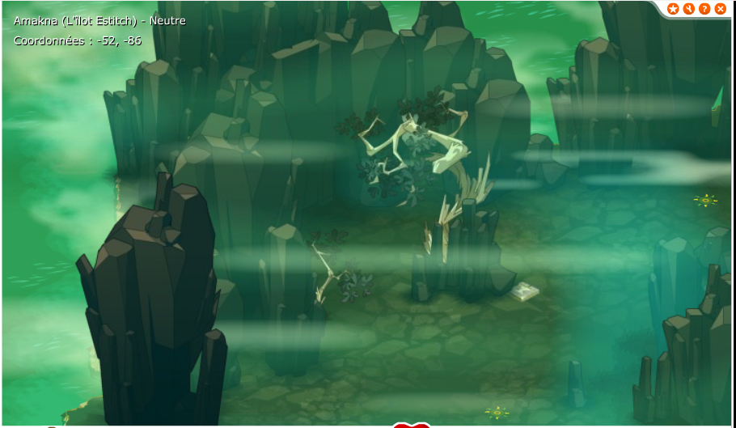
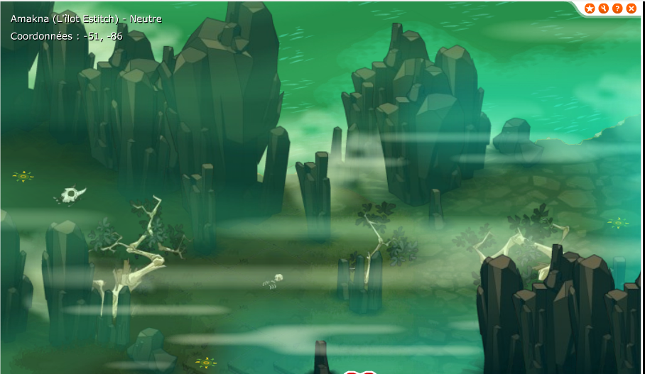
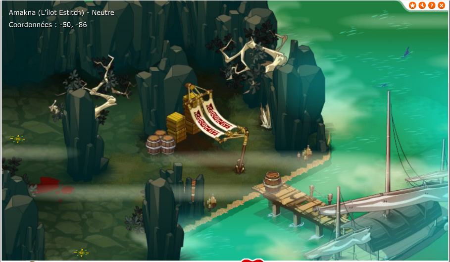   

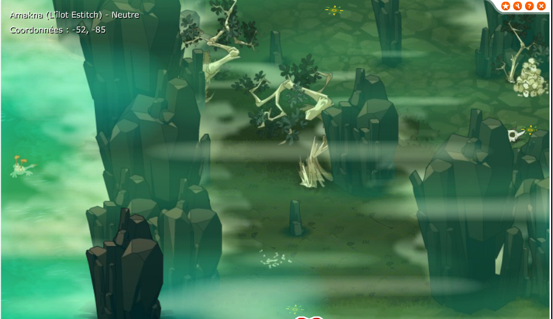
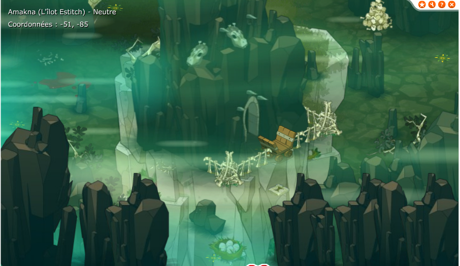
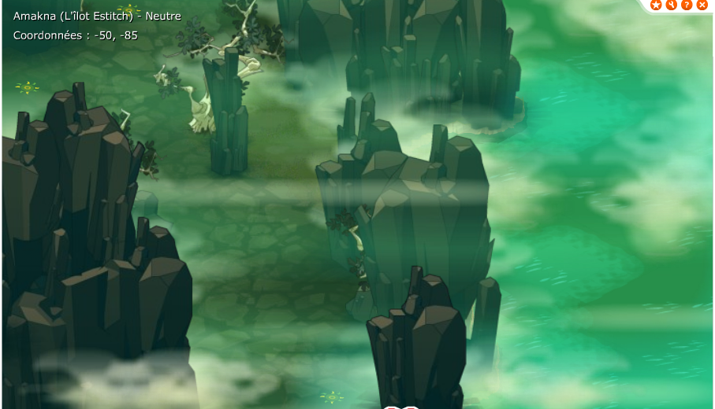  

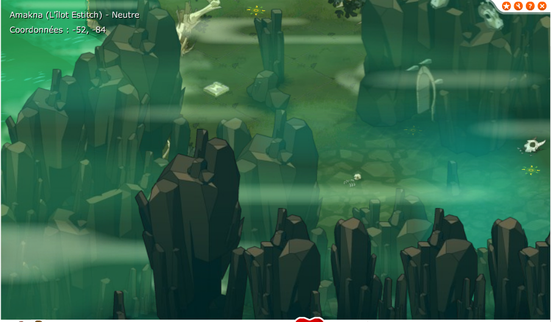
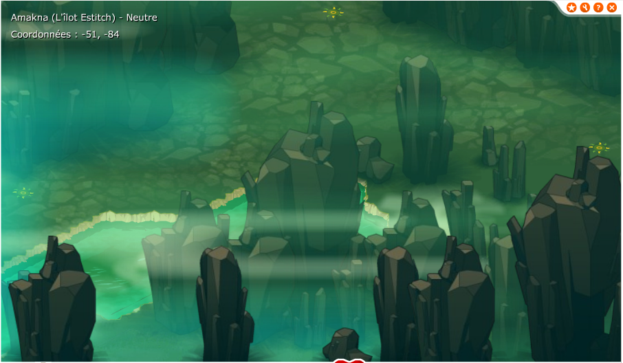
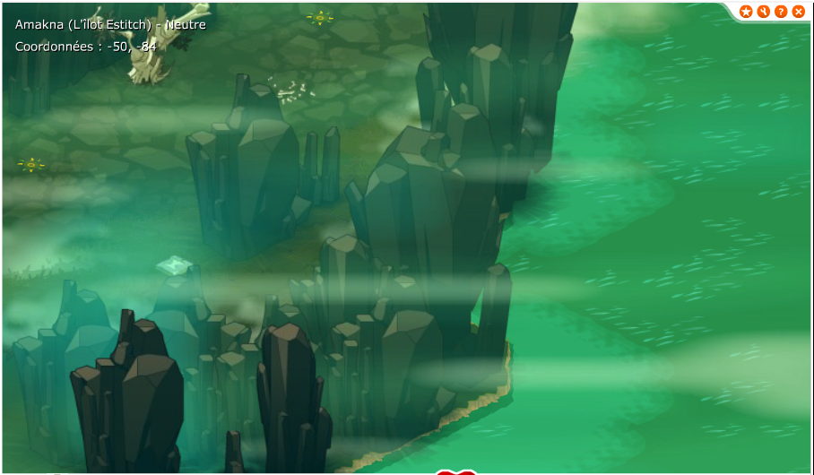  

Et la "grotte" intérieure de l'ile:
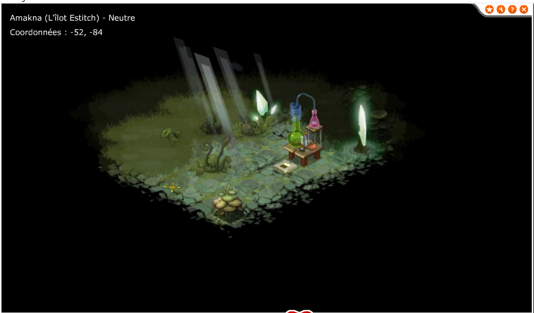
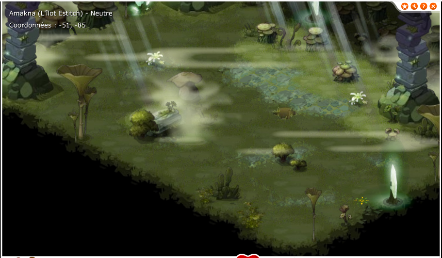
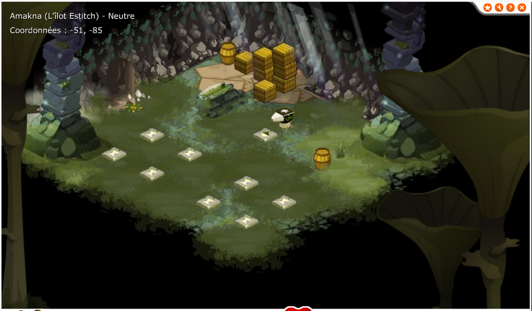

## Les suppositions

1. Comme beaucoup de contenu ajouté entre les version 1.21 et 1.29, il s'agit du contenu prévu pour les quêtes d'alignement.  
2. On peux imaginer que les quêtes d'alignement devaient être terminées avant que dofus 2.0 sorte, peux être que dofus 2.0 a pris de l'avance et à entrainé le fait que le contenu prévu pour les quêtes d'alignements  n'est finalement pas officiellement sorti, on peux relier cette zone à d'autres éléments comme les donjons d'ilyzaelle et de ku'tan mais aussi beaucoup de maps et zones comme le sanctuaire d'hotomani et la zone sud ouest de brakmar.  
Le déploiement plus rapide que prévu de dofus 2.0 a pu enclencher le développement de frigost plutot que le fait de finir les quêtes d'alignement.  
3. La ressemblance de cette version avec l'ile actuelle montre que la refonte des quêtes alignements à en grande partie repris le contenu d'origine des quêtes alignement.

## Divers liens / sources
[Un sujet du forum officiel.](https://www.dofus.com/fr/forum/1003-divers/1932436-legendes-mysteres-dofus?sort=rate_D&page=1)
[Un autre sujet du forum officiel.](https://www.dofus.com/fr/forum/1807-monocomptes/2353772-ilot-estitch-spoil-secret-bien-garde)
[Un sujet d'un blog.](https://loleyke.skyrock.com/3249742416-Hors-serie-Un-article-un-peu-special.html)

- Lié au sanctuaire Hotomani?

- sub area 501
- Implanté en 1.27? ( aucune idée si c'est exactement cette version)
    - => Correspond a une histoire de quete bonta = sanctuaire hotomani, brak = ilot estitch

mapid:
 12151 12152 12153 12154 12155 12156 12157 12158 12159 
 intérieur? 12164 12165 12166  

-> Comparé a ce qu'on peux lire, le monstre pumbaa a été pensé pour l'ile d'otomai, pas l'ilot estitch.
        -> Montre nommé: "Phacochere rider" sprite id 1597 en tant que montre des plaines herbeuses.
